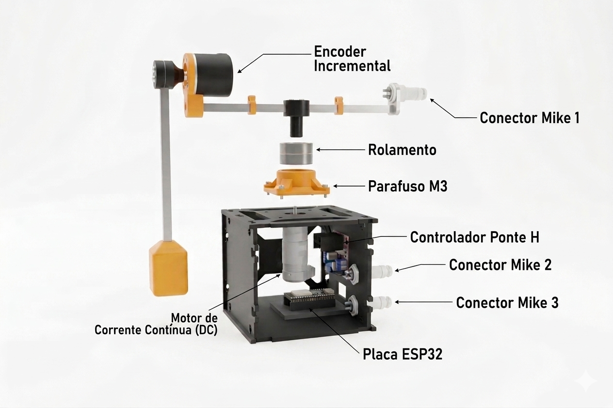

# Rotational Inverted Pendulum Furuta Fuzzy Control

Este repositório contém o firmware e as ferramentas auxiliares utilizadas no desenvolvimento de uma bancada didática de baixo custo para controle de um pêndulo invertido rotacional, também conhecido como pêndulo de Furuta.

O projeto utiliza uma ESP32 para leitura dos encoders, acionamento do motor por ponte H e execução de uma estratégia de controle PID com supervisão fuzzy. Além do firmware embarcado, o repositório inclui uma interface em Python para ajuste de parâmetros, envio de comandos pela serial, visualização em tempo real e coleta de dados experimentais.

---

## Modelo 3D da bancada

A estrutura mecânica foi projetada em 3D para auxiliar na definição da montagem física, posicionamento dos componentes e reprodução da bancada.



---

## Estrutura do repositório

```text
.
├── controle/
│   ├── include/
│   │   ├── ang.h
│   │   ├── arm_centering_fuzzy.h
│   │   ├── calibration.h
│   │   ├── config.h
│   │   ├── control.h
│   │   ├── encoder.h
│   │   ├── filas.h
│   │   ├── motor.h
│   │   ├── params.h
│   │   ├── pid.h
│   │   ├── serial_cmd.h
│   │   ├── serial_tx.h
│   │   └── tipos.h
│   ├── src/
│   │   ├── arm_centering_fuzzy.cpp
│   │   ├── calibration.cpp
│   │   ├── control.cpp
│   │   ├── encoder.cpp
│   │   ├── filas.cpp
│   │   ├── main.cpp
│   │   ├── motor.cpp
│   │   ├── params.cpp
│   │   ├── pid.cpp
│   │   ├── serial_cmd.cpp
│   │   └── serial_tx.cpp
│   ├── test/
│   └── platformio.ini
│
└── pid_serial_tuner/
    ├── pid_config.json
    ├── requirements.txt
    └── tuner.py
```

---

## Componentes principais

| Componente | Função |
|---|---|
| ESP32 WROOM | Controle, leitura dos sensores e comunicação serial |
| Encoder E38S6G5-600B-G24N | Leitura angular do pêndulo |
| Motor JGA25-371 12 V | Acionamento do braço rotativo |
| Ponte H L298N | Interface de potência para acionamento do motor |
| Fonte de bancada 12 V | Alimentação do motor e da ponte H |
| Conectores Mike | Organização e conexão dos sinais elétricos |

---

## Funcionamento geral

O firmware embarcado na ESP32 executa as seguintes funções:

- leitura dos encoders;
- cálculo dos ângulos do pêndulo e do braço;
- execução do controlador PID discreto;
- aplicação da supervisão fuzzy para ajuste auxiliar do ponto de operação;
- saturação do sinal de controle;
- conversão do comando em PWM;
- acionamento do motor por ponte H;
- transmissão de telemetria pela serial;
- recepção de comandos enviados pela interface Python.

A interface Python permite:

- selecionar e abrir a porta serial;
- ajustar os ganhos do PID;
- alterar os parâmetros do mecanismo fuzzy;
- enviar comandos para a ESP32;
- visualizar gráficos em tempo real;
- iniciar e parar o sistema;
- coletar dados experimentais em arquivos `.csv`.

---

## Requisitos

### Firmware embarcado

Para compilar e gravar o firmware na ESP32, é necessário instalar:

- Visual Studio Code;
- extensão PlatformIO IDE;
- cabo USB para conexão com a ESP32.

### Interface Python

Para executar a interface de ajuste e telemetria, é necessário instalar:

- Python 3.10 ou superior;
- pip;
- dependências listadas em `requirements.txt`.

As dependências utilizadas são:

```text
pyserial
numpy
PySide6
pyqtgraph
```

---

## Instalação do PlatformIO

### Pelo Visual Studio Code

1. Instale o Visual Studio Code.
2. Abra o VS Code.
3. Acesse a aba de extensões.
4. Pesquise por `PlatformIO IDE`.
5. Instale a extensão.
6. Reinicie o VS Code após a instalação.
7. Abra a pasta `controle/` como projeto PlatformIO.

---

## Compilação e gravação do firmware

Entre na pasta do firmware:

```bash
cd controle
```

Compile o projeto:

```bash
pio run
```

Grave o firmware na ESP32:

```bash
pio run --target upload
```

Abra o monitor serial:

```bash
pio device monitor
```

Também é possível executar essas ações diretamente pela interface do PlatformIO no VS Code:

- `Build` para compilar;
- `Upload` para gravar;
- `Monitor` para abrir a serial.

---

## Configuração da placa

A placa utilizada deve estar configurada no arquivo `platformio.ini`.

Exemplo:

```ini
[env:esp32doit-devkit-v1]
platform = espressif32
board = esp32doit-devkit-v1
framework = arduino
monitor_speed = 115200
```

Caso utilize outro modelo de ESP32, ajuste o campo `board` conforme a placa utilizada.

---

## Instalação da interface Python

Entre na pasta da interface:

```bash
cd pid_serial_tuner
```

Crie um ambiente virtual:

### Linux/macOS

```bash
python -m venv .venv
source .venv/bin/activate
```

### Windows PowerShell

```powershell
python -m venv .venv
.venv\Scripts\Activate.ps1
```

Instale as dependências:

```bash
pip install -r requirements.txt
```

---

## Execução da interface

Com o ambiente virtual ativado, execute:

```bash
python tuner.py
```

A interface abrirá uma janela com:

- seleção da porta serial;
- campos para ajuste dos ganhos PID;
- campos para ajuste dos parâmetros fuzzy;
- botões para iniciar/parar o sistema;
- gráficos em tempo real;
- opção de coleta de dados.

---

## Fluxo básico de uso

1. Conecte a ESP32 ao computador via USB.
2. Grave o firmware usando PlatformIO.
3. Abra a interface Python.
4. Selecione a porta serial correspondente à ESP32.
5. Clique em `Conectar`.
6. Ajuste os ganhos PID e os parâmetros fuzzy.
7. Clique em `Aplicar GP` para enviar os ganhos PID.
8. Clique em `Enviar fuzzy p/ ESP32` para enviar os parâmetros fuzzy.
9. Clique em `INICIAR` para iniciar o controle.
10. Use `STOP` para parar o sistema.

---

## Arquivo de configuração

A interface utiliza o arquivo:

```text
pid_serial_tuner/pid_config.json
```

Esse arquivo armazena os últimos parâmetros utilizados, incluindo:

- ganhos PID;
- região de início da ação fuzzy;
- região de ação máxima fuzzy;
- offset máximo de setpoint;
- limiar de velocidade alta.

Exemplo:

```json
{
  "pendulo": {
    "kp": 290.0,
    "ki": 0.0,
    "kd": 0.0
  },
  "fuzzy_braco": {
    "inicio_acao_deg": 20.0,
    "acao_maxima_deg": 30.0,
    "offset_max_setpoint_deg": 0.5,
    "limiar_vel_alta_deg_s": 500.0
  }
}
```

---

## Coleta de dados

A interface permite iniciar e parar a coleta de dados experimentais.

Os arquivos são salvos automaticamente na pasta:

```text
pid_serial_tuner/coletas/
```

Cada coleta gera um arquivo `.csv` contendo:

- tempo;
- ângulo do pêndulo;
- setpoint;
- ângulo do braço;
- erro;
- duty cycle;
- ganhos PID;
- parâmetros fuzzy.

---

## Comandos seriais

O firmware recebe comandos pela serial para alteração dos parâmetros e controle da execução.

### Alterar ganhos PID

```text
GP 290.0 0.0 0.0
```

Formato:

```text
GP Kp Ki Kd
```

### Alterar parâmetros fuzzy

```text
FZ 20.0 30.0 0.5 500.0
```

Formato:

```text
FZ inicio_acao_deg acao_maxima_deg offset_max_setpoint_deg limiar_vel_alta_deg_s
```

### Alterar setpoint

```text
SP 0.0
```

### Iniciar controle

```text
START
```

### Parar controle

```text
STOP
```

---

## Telemetria serial

Durante a execução, a ESP32 envia dados no formato:

```text
T,<tempo_ms>,TH,<angulo_pendulo>,THM,<angulo_braco>,SP,<setpoint>,E,<erro>,DUTY,<duty>
```

Esses dados são processados pela interface Python para geração dos gráficos em tempo real e armazenamento dos dados experimentais.

---

## Observações sobre o protótipo

Por se tratar de uma bancada didática de baixo custo, o sistema apresenta algumas limitações mecânicas típicas de protótipos experimentais, como:

- folga mecânica na transmissão;
- zona morta no acionamento;
- atrito estático;
- pequenas variações em torno do ponto de equilíbrio;
- sensibilidade à montagem, alinhamento e rigidez estrutural.

Essas limitações influenciam a resposta experimental, principalmente nas inversões de sentido do motor e nas correções próximas ao ponto de equilíbrio.

---

## Recomendações de teste

Antes de executar o controle com o pêndulo livre, recomenda-se:

1. verificar todas as conexões elétricas;
2. confirmar se a fonte está ajustada em 12 V;
3. testar a leitura dos encoders;
4. testar o sentido de rotação do motor;
5. iniciar com ganhos PID baixos;
6. aumentar os ganhos gradualmente;
7. manter uma forma segura de interromper o sistema;
8. evitar deixar o sistema operando sem supervisão.

---

## Problemas comuns

### A porta serial não aparece

Verifique se:

- a ESP32 está conectada ao computador;
- o cabo USB transmite dados;
- o driver USB da placa está instalado;
- outro programa não está usando a mesma porta.

### Erro ao abrir a serial

Feche o monitor serial do PlatformIO ou qualquer outro programa que esteja usando a porta.

### A interface abre, mas não mostra dados

Verifique se:

- o firmware foi gravado corretamente;
- a taxa serial é `115200`;
- a porta correta foi selecionada;
- o comando `START` foi enviado;
- a ESP32 está transmitindo telemetria.

### O motor não responde a comandos baixos

Isso pode ocorrer devido à zona morta do conjunto motor/ponte H. No firmware, é utilizada uma compensação com duty mínimo para vencer o atrito estático e iniciar o movimento.

---

## Licença

Este projeto é disponibilizado para fins didáticos e acadêmicos.
